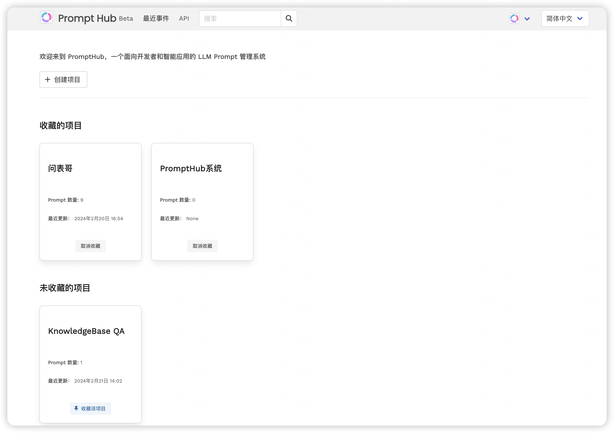
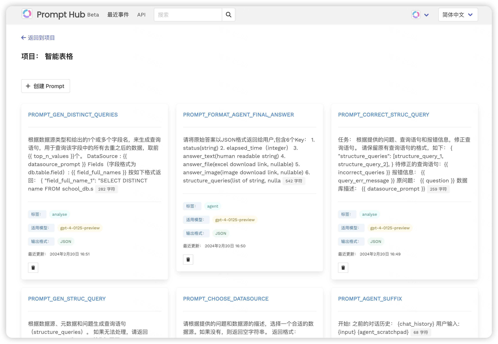
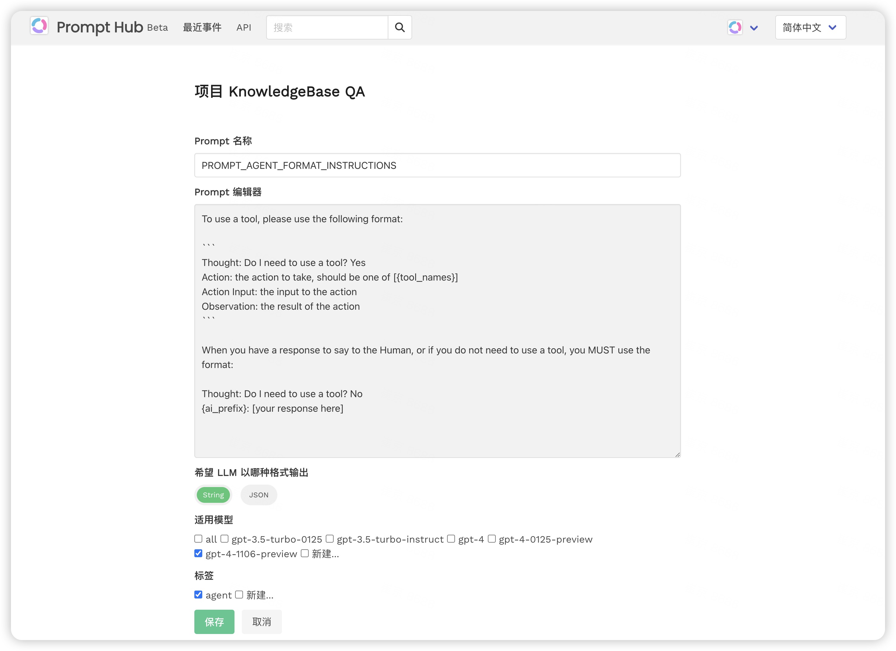
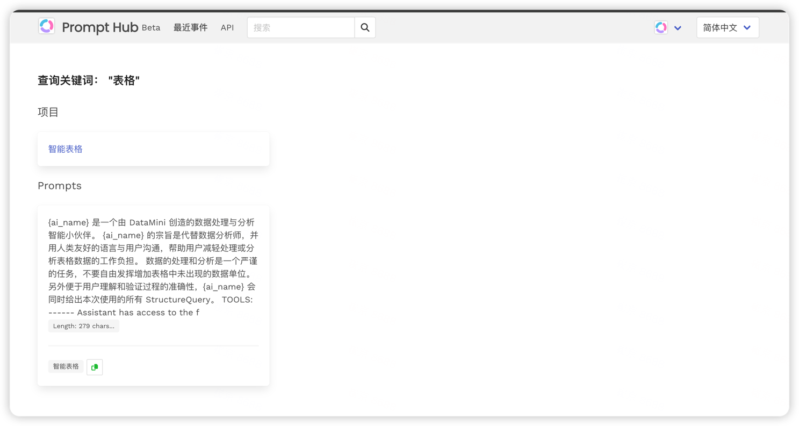
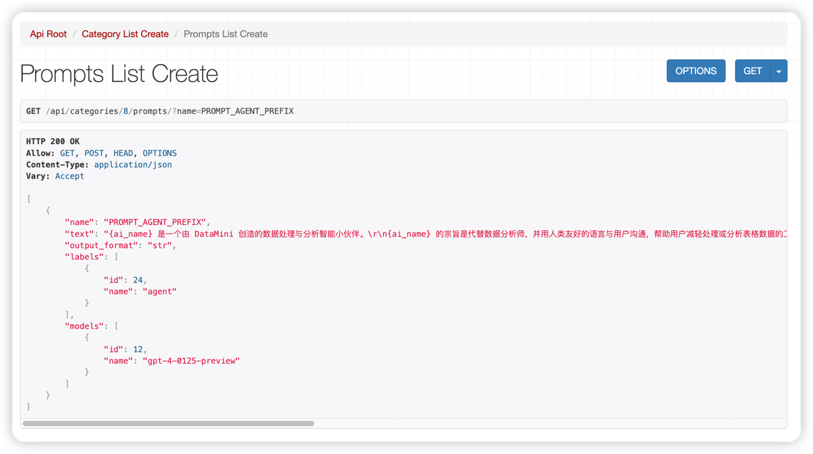

<p align="center">
    
</p>

# PromptHub：您的AI Prompt 管理利器

[English Doc](README_EN)

## 简介

在AI智能应用开发的世界里，Prompt 不仅是连接人类语言与机器智能的桥梁，更是现代化智能应用不可或缺的组成部分。

PromptHub 旨在为开发者提供一个简单、轻量且易于集成的管理系统，帮助您管理 Prompts。

## 特色

- **易用的API/SDK**：通过可视化 UI 和简便的 API/SDK，PromptHub 为开发者提供无缝的集成体验。
- **Code与Prompt解耦**：专注于将提示词（Prompt）与代码逻辑（Code）分离，为生产环境下的系统提供稳定的基础设施支持。
- **多模型支持**：可指定适用的AI模型（GPT-4, GPT-3.5等），根据需求选择最合适的模型以优化成本。
- **灵活的输出格式**：支持自定义Prompt的输出格式（JSON或String），满足不同场景下的需求。
- **一站式管理**：集中管理多个项目的Prompt，提高效率。
- **多语言支持**：支持中英文
- **版本控制**：支持 Prompt 版本保存，方便进行A/B测试和快速回滚（规划中）
- **性能优化**：利用 GPT-4等模型 对 Prompt 格式和内容进行优化，提高准确率，同时减少 Token 使用以节省成本（规划中）
- **多用户支持**：支持多用户模式，可以按照项目来管理权限（规划中）
- **集成LLM**：与GPT-4、文心一言等大模型集成，可以直接在 PromptHub 中测试 Prompt 的效果（规划中）

## 使用

使用 `pip` 安装客户端（1.6KB）：

```shell    
pip install prompthub
```

```python
from prompthub import PromptHub
prompts = PromptHub('http://localhost:8000', 'your_token', category='rmb-prod')

prompt = prompts.get('your_prompt_name')

preferred_model = prompt.model
prompt_text = prompt.text
prompt_output_format = prompt.output_format
```

详细用法请参考 [客户端使用说明](client%2FREADME.md)


# 管理页面截图

## 项目

在 PromptHub 中，项目是一个资源组的概念，项目和项目之间的 Prompt 是相互独立的。建议你为不同的应用创建不同的项目。

未来，可以按照项目来管理权限。有某个项目权限的人，才能修改这个项目的 Prompt。

<table><tr><td></td></tr></table>


## Prompt

<table><tr><td></td></tr></table>

每一个 Prompt 都属于一个项目。创建 Prompt 的时候，可以指定适用的模型，输出格式，也可以为项目打上标签，便于查找和分类。


## 编辑 Prompt
<table><tr><td></td></tr></table>


## 搜索

根据关键词或者标签搜索相关的 Prompt
<table><tr><td></td></tr></table>

## API

```json
{
    "Categories": "http://127.0.0.1:8000/api/categories/",
    "Prompts": "http://127.0.0.1:8000/api/categories/1/prompts/",
    "Labels": "http://127.0.0.1:8000/api/categories/1/labels/",
    "Models": "http://127.0.0.1:8000/api/categories/1/models/"
}
```

<table><tr><td></td></tr></table>


# 服务端部署


## 使用 [Docker 镜像](https://hub.docker.com/r/datamini/prompt-hub) 快速部署

```bash
docker run -d -p 8000:8000 datamini/prompt-hub
```

注：
1. 浏览器打开 http://127.0.0.1:8000/  默认用户名密码：`admin/admin`
2. 默认使用本地SQLite数据库


## 使用Docker Compose 部署

```shell
version: '3.8'
services:
  prompt-hub:
    image: datamini/prompt-hub
    privileged: true
    ports:
      - "8000:8000"
    environment:
      SUPERUSER_NAME: admin
      SUPERUSER_PASSWORD: admin
      SUPERUSER_EMAIL: x@x.x
      TIME_ZONE: Asia/Shanghai  
      DB_TYPE: mysql # mysql or postgresql or sqlite
      DB_HOST: 127.0.0.1
      DB_NAME: db01
      DB_USER: admin
      DB_PASS: admin
```

# 开发者指北

请参考 [开发者文档](README4DEV_zh.md)

# 致谢

PromptHub 基于 Vidura 进行二次开发，我们对 Vidura 团队表示深深的感谢。PromptHub 承诺将完全开源，以回馈社区。

# 加入我们

无论您是希望提高工作效率的开发者，还是对 AI Prompt 管理系统感兴趣的技术爱好者，PromptHub 都欢迎您的加入。
lele@datamini.ai（坐标中国杭州）


