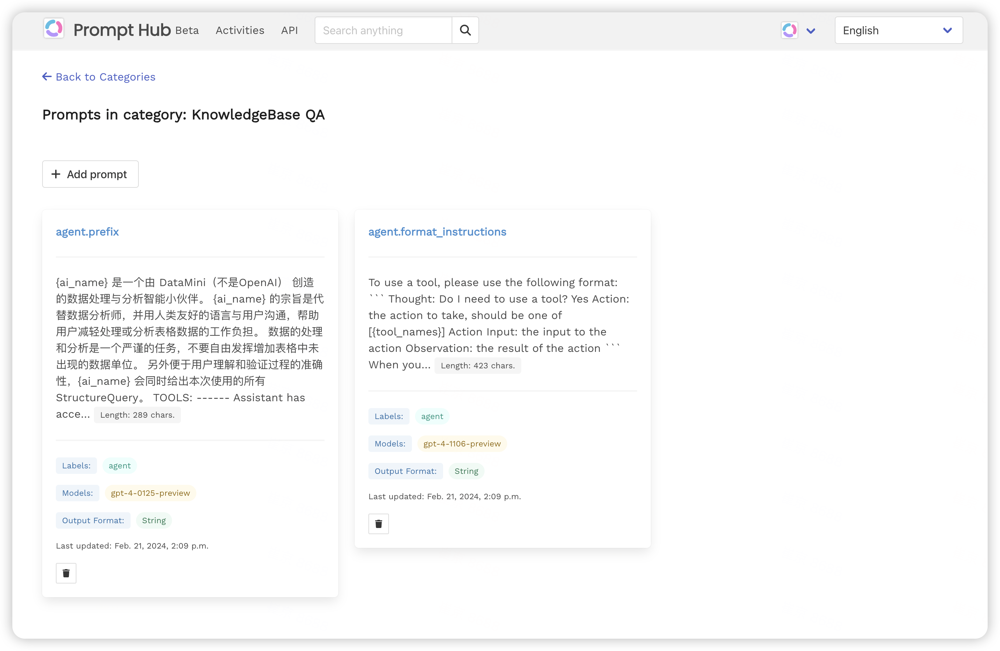

[](https://github.com/narenaryan/Vidura/actions/workflows/django.yml)

<p align="center">
    
</p>

Are you a ChatGPT prompt engineer?. Welcome to your all-in-one ChatGPT prompt management system. If you are saving emerging prompts on text editors, git, and on xyz, now goes the pain to add, tag, search and retrieve.

Prompts are nothing but thoughts out of our mind like communication. But, complex thougts easily eascape our memory. Moreover, connecting thoughts is harder. Vidura solves that problem for prompt engineers by streamlining their thoughts/prompts. 


This is a basic version for personal use, but if you want to preview more exciting features, like:

1. Rate your prompts by quality (prompt efficiency score)
2. API to import and export categories and prompts
3. Support for managing multiple types of prompts (ChatGPT, Stable Diffusion, Custom prompts)
4. Be part of a global prompt-engineering community,

visit: https://vidura.ai

Signup for free with your google account and start prompting in seconds. 😉

# Screenshots
## Categories view
<table><tr><td></td></tr></table>

We simplified categories for you. You can request new categories and we will add it for you.

## Prompts view
<table><tr><td></td></tr></table>

Each prompt will have a list of labels attached like "gpt-3", "simple", or "complex". User can click on a label on any prompt and visit all the prompts tagged with the given label name. 

## Edit Prompt view
<table><tr><td></td></tr></table>

## Create new prompt using editor
<table><tr><td></td></tr></table>

## Universal search
One can search matching categories and prompts in one place by using search bar.
<table><tr><td></td></tr></table>

## Copy to Clipboard & Open ChatGPT from Vidura
Click the "Copy to clipboard" button and click the Chat GPT logo to open a new ChatGPT window. Hit Ctrl or Cmd(Mac OS) + v to paste your prompt into ChatGPT.

## Checkout cool prompts shared by community
To checkout all cool prompts shared by other users, head to homepage by clicking "Vidura" logo. By default, when a user creates a public prompt, it is shared to all others as a "community" labelled prompt in respective category.
<table><tr><td></td></tr></table>

## How to run Vidura ?
You can run this software by installing Python 3.9 or above on your machine, and install developer dependencies on your Python environment like:

```bash
pip install -r requirements.txt
```

## Run db migrations
```bash
python manage.py migrate
```

## Create a super user
```bash
python manage.py createsuperuser
```
and enter required credentials to use for basic auth.

## Set environment variables
```bash
export ENV=development
export TIME_ZONE=Asia/Shanghai
````

## Run the server locally
```bash
python manage.py runserver
```

Access server at http://127.0.0.1:8000 and enter the credentials created before to launch Vidura dashboard.

**Note**: Vidura is a court minister and advisor from ancient Indian epic "Mahabharata". https://en.wikipedia.org/wiki/Vidura

# Token Authentication for API

## 生成 Token | Create Token

对于每个用户，你需要生成一个认证Token。这可以通过管理命令、Django管理后台或者编写自己的视图或命令来完成。
For each user, you need to generate an authentication token. This can be done using the management command, the Django admin, or by writing your own views or commands.

Django REST Framework提供了一个管理命令来手动生成Token：
Django REST Framework provides a management command to manually generate tokens:

> python manage.py drf_create_token <username>

## 使用Token | Use Token

客户端在请求头中发送Token来进行认证。格式如下：
Client should send the Token in the request header for authentication. The format is:

> Authorization: Token <your_token_here>


# Backlog

- category是资源组的概念。label 应该属于某个category，category删除之后，关联的prompt&label都应该被删除
- 创建prompt的时候，可以指定适应的模型类型，输出格式等
- 可以通过API完成prompt的录入
- 增加client端支持
- 单用户模式（包含关系如下： User -> Category -> Prompt | Label）
